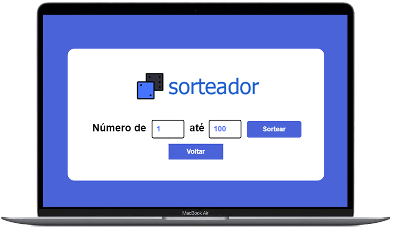

# Sorteador

 
### Project Link: [Sorteador](https://joaopedropsilva.github.io/sorteador/)

## 📖 Sobre o Projeto / About the Project

### :brazil:
Sorteador online de números ou pessoas.
 
**Este é um exercício do curso [Dev Web FullStack - Prog BR](https://programadorbr.com)**

### :us:
Online number or people random selector.
 
**This is an exercise from the course [FullStack Web Dev - Prog BR](https://programadorbr.com)**

## 💻 Tecnologias / Technologies
* HTML
* CSS
* JavaScript
